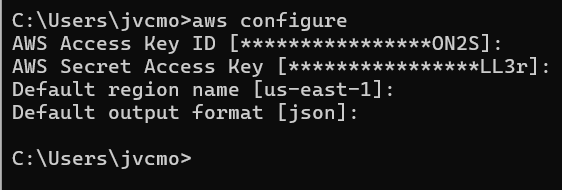

### Documentação

- Terraform baixado

-Terraform Inicializado

-Aws credenciais: 
Configurada
  
Painel:

 - Teffarom inicializado com sucesso!
 

 - Erro 403 , algo relacionado a região provavelmente:
 

 - Erro 403, agora para TokenId:
 

 Após esse erro de TokenId invalido não consegui prosseguir.

